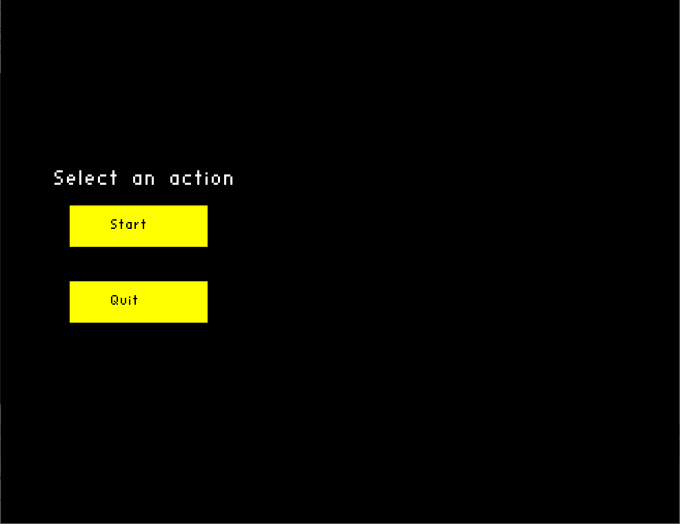
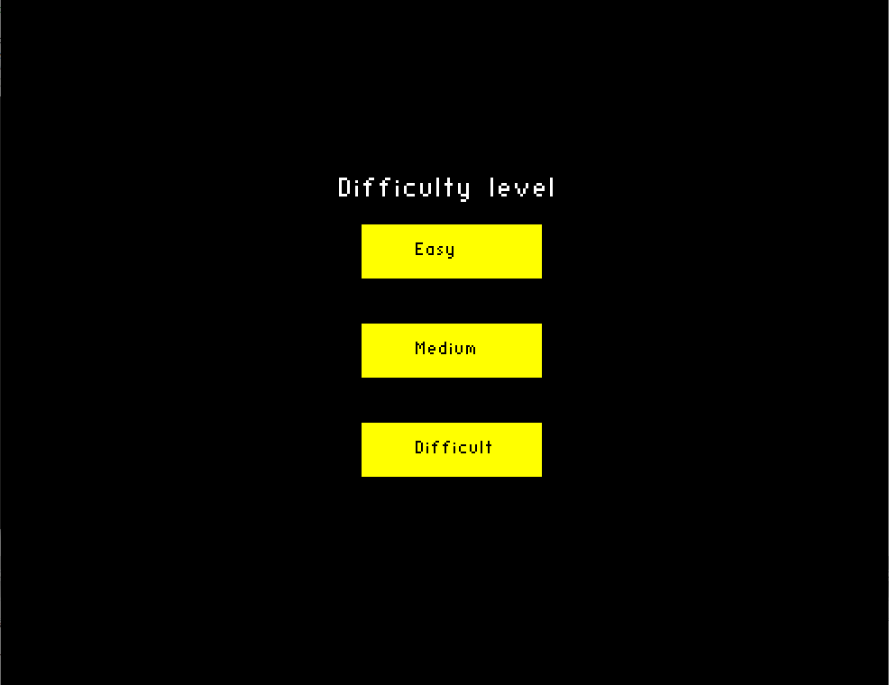
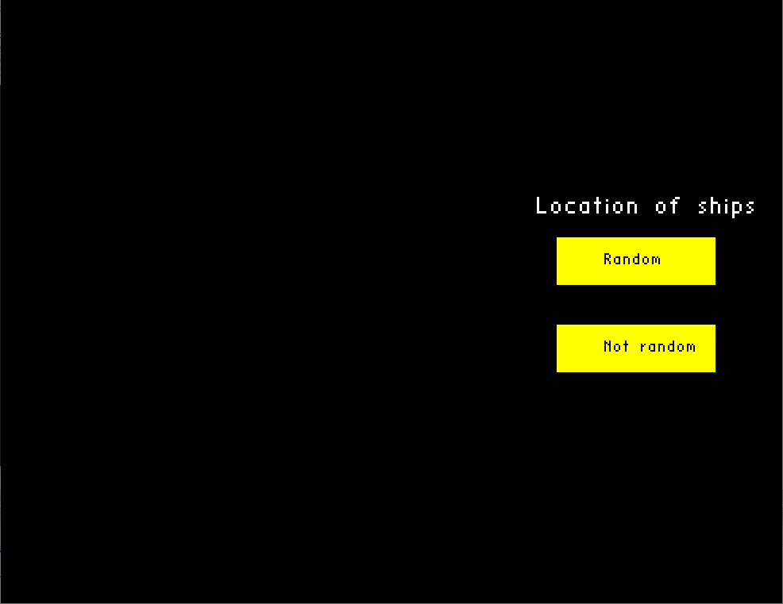
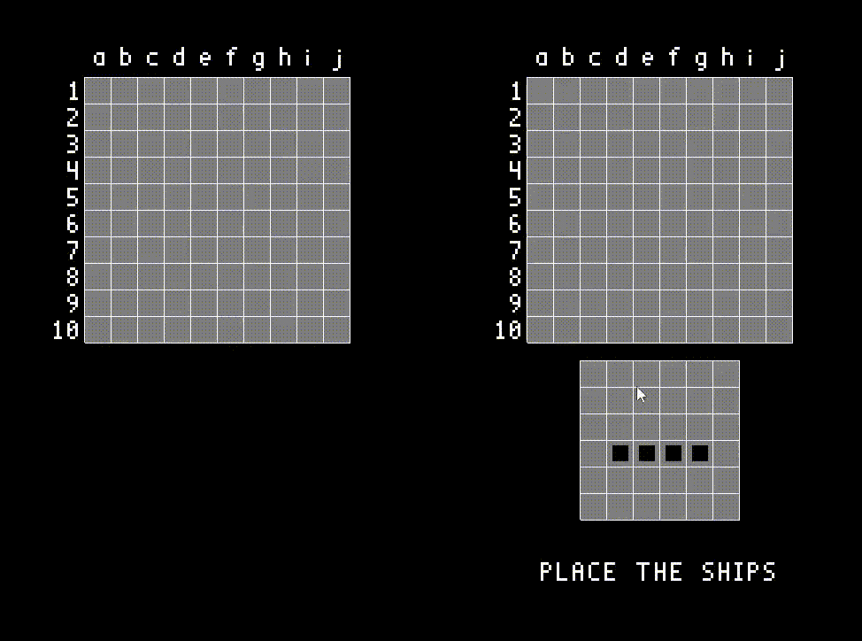

# Game Sea Battle

---

## Project Overview

This project was created to showcase the knowledge and skills in OpenGL that I acquired while 
completing practical tasks such as the Game Minesweeper.

The Sea Battle game is a competition between the player and the computer following the usual rules 
of naval warfare. The game includes three difficulty levels; the higher the level, the better the 
computer plays. Ships can be placed either randomly or manually.

---

## Technologies Used

- **Programming Language**: C
- **Graphics Library**: OpenGL

---

## Game Rules

Each player has a 10x10 grid where ships are placed. The player alternates with the computer to fire at 
the opponent's grid, trying to sink the enemy fleet. When a player hits an enemy ship, they can fire again. 
The game continues until one player runs out of ships.

---

## Menu

**Start**

**Difficulty level selection**

**Ship location selection**

---

## Gameplay

**Easy level** - the computer always chooses cells randomly.

**Medium level** - the computer chooses cells randomly, but after the first hit, it tries to finish off the ship.

**Difficult level** - the computer selects cells according to an algorithm and after a hit, it tries to finish off the ship.

In the manual placement mode, the player can strategically place each ship on their grid before starting the game

Example of **manual ship placement**:

---

## Conclusion

The Sea Battle project has been a great exercise in applying my OpenGL skills. Developing the game allowed 
me to enhance my programming abilities in C and to understand more deeply the complexities of game design. 
This experience has been invaluable in preparing me for more advanced projects in the future.
